# AWS ECS Deployment Architecture

## Resource Overview

```mermaid
graph TB
    subgraph "Internet"
        User[👤 User Request<br/>test.stoneware.rocks]
    end

    subgraph "Baseline Infrastructure<br/>(Created Once, Shared)"
        subgraph "ACM"
            Cert[🔒 ACM Certificate<br/>*.stoneware.rocks<br/>Purpose: HTTPS/TLS]
        end

        subgraph "VPC"
            subgraph "Public Subnets"
                ALB[⚖️ Application Load Balancer<br/>Purpose: Route traffic & TLS termination]
                NAT[🌐 NAT Gateway<br/>Purpose: Outbound internet for tasks]
            end

            subgraph "Private Subnets"
                Tasks1[Container Tasks]
                Tasks2[Container Tasks]
            end

            ALBSg[🛡️ ALB Security Group<br/>Allows: 80, 443 from internet]
            ServiceSg[🛡️ Service Security Group<br/>Allows: 8000 from ALB only]
        end

        Listener[🎯 HTTPS Listener :443<br/>Purpose: Handle HTTPS, route to target groups]

        Cluster[📦 ECS Cluster<br/>Purpose: Logical grouping of tasks]

        ECR[📚 ECR Repository<br/>Purpose: Store Docker images]

        Logs[📊 CloudWatch Log Group<br/>/aws/pulse/test/app<br/>Purpose: Container logs]

        IAM[👤 IAM Roles<br/>- Task Execution Role<br/>- Task Role<br/>Purpose: AWS permissions]
    end

    subgraph "Deployment 1<br/>(test-20251027-121827Z)"
        Image1[🐳 Docker Image<br/>test:test-20251027-121827Z<br/>Purpose: App code + drain secret]
        TaskDef1[📝 Task Definition<br/>test-app:1<br/>Purpose: How to run container<br/>- CPU: 256, Memory: 512<br/>- Port: 8000<br/>- Env: DEPLOYMENT_ID]
        TG1[🎯 Target Group<br/>test-20251027-121827Z<br/>Purpose: Route to this deployment's tasks<br/>Health: /_health every 30s]
        Rule1[📋 Listener Rule<br/>Priority: 100<br/>If: X-Pulse-Render-Affinity = test-20251027-121827Z<br/>Purpose: Sticky sessions for this version]
        Service1[⚙️ ECS Service<br/>test-20251027-121827Z<br/>Purpose: Maintain 2 running tasks<br/>Launch Type: Fargate]
        Task1A[🏃 Task Instance 1]
        Task1B[🏃 Task Instance 2]
    end

    subgraph "Deployment 2<br/>(test-20251027-122112Z) - ACTIVE"
        Image2[🐳 Docker Image<br/>test:test-20251027-122112Z]
        TaskDef2[📝 Task Definition<br/>test-app:2]
        TG2[🎯 Target Group<br/>test-20251027-122112Z]
        Rule2[📋 Listener Rule<br/>Priority: 101<br/>If: X-Pulse-Render-Affinity = test-20251027-122112Z]
        Service2[⚙️ ECS Service<br/>test-20251027-122112Z]
        Task2A[🏃 Task Instance 1]
        Task2B[🏃 Task Instance 2]
    end

    Default[🔄 Listener Default Action<br/>Purpose: Route new traffic<br/>→ Currently: TG2]

    %% Connections
    User -->|HTTPS| ALB
    ALB -->|Uses| Cert
    ALB --> Listener
    ALB -.->|Protected by| ALBSg

    Listener -->|Check rules| Rule1
    Listener -->|Check rules| Rule2
    Listener -->|No match?| Default

    Rule1 -->|Forward| TG1
    Rule2 -->|Forward| TG2
    Default -->|Forward 100%| TG2

    TG1 -->|Health checks| Task1A
    TG1 -->|Health checks| Task1B
    TG2 -->|Health checks| Task2A
    TG2 -->|Health checks| Task2B

    Service1 -->|Maintains| Task1A
    Service1 -->|Maintains| Task1B
    Service1 -->|Uses| TaskDef1
    Service1 -->|Registers with| TG1

    Service2 -->|Maintains| Task2A
    Service2 -->|Maintains| Task2B
    Service2 -->|Uses| TaskDef2
    Service2 -->|Registers with| TG2

    TaskDef1 -->|Pulls| Image1
    TaskDef2 -->|Pulls| Image2

    Image1 -.->|Stored in| ECR
    Image2 -.->|Stored in| ECR

    Task1A -.->|Runs in| Cluster
    Task1B -.->|Runs in| Cluster
    Task2A -.->|Runs in| Cluster
    Task2B -.->|Runs in| Cluster

    Task1A -.->|Protected by| ServiceSg
    Task1B -.->|Protected by| ServiceSg
    Task2A -.->|Protected by| ServiceSg
    Task2B -.->|Protected by| ServiceSg

    Task1A -->|Logs to| Logs
    Task1B -->|Logs to| Logs
    Task2A -->|Logs to| Logs
    Task2B -->|Logs to| Logs

    Task1A -.->|Uses| IAM
    Task1B -.->|Uses| IAM
    Task2A -.->|Uses| IAM
    Task2B -.->|Uses| IAM

    Task1A -->|Egress via| NAT
    Task1B -->|Egress via| NAT
    Task2A -->|Egress via| NAT
    Task2B -->|Egress via| NAT

    classDef baseline fill:#e1f5ff,stroke:#0066cc,stroke-width:2px
    classDef deployment1 fill:#fff4e1,stroke:#ff9900,stroke-width:2px
    classDef deployment2 fill:#e8f5e9,stroke:#4caf50,stroke-width:2px
    classDef active fill:#c8e6c9,stroke:#2e7d32,stroke-width:3px

    class Cert,ALB,Listener,Cluster,ECR,Logs,IAM,ALBSg,ServiceSg,NAT baseline
    class Image1,TaskDef1,TG1,Rule1,Service1,Task1A,Task1B deployment1
    class Image2,TaskDef2,TG2,Rule2,Service2,Task2A,Task2B deployment2
    class Default active
```

## Traffic Flow

## Key Design Decisions

### 1. **Target Group Must Be Attached Before Service Creation**

**The Bug We Fixed:** AWS requires target groups to have a listener association **before** creating an ECS service with `loadBalancers` configuration.

**Solution:** Create the listener rule (attaching TG to listener) immediately after creating the TG, before creating the ECS service.

### 2. **Header-Based Sticky Sessions**

**Purpose:** Support multiple concurrent deployments with session affinity.

**How it works:**

- Each deployment gets a unique ID (e.g., `test-20251027-122112Z`)
- ALB sets cookie `X-Pulse-Render-Affinity` with the deployment ID
- Listener rules match on this header value
- Users stick to the deployment they first landed on
- New users get the default action (latest deployment)

### 3. **Zero-Downtime Deployments**

**Old deployment stays running** while new deployment spins up:

1. Deploy new version → New TG + Service + Tasks
2. Switch default action → New users get new version
3. Old users keep using old version (via header rules)
4. Drain old deployment when ready (POST to `/drain` with secret)

### 4. **Fargate Launch Type**

**Why Fargate:** No EC2 instances to manage. AWS handles:

- Instance provisioning
- Patching
- Scaling
- Availability

Tasks run in private subnets with NAT gateway for internet access.

### 5. **Health Checks**

**Two levels:**

- **ALB Target Group:** HTTP GET `/_health` every 30s
  - 2 consecutive successes = healthy
  - 3 consecutive failures = unhealthy
- **ECS Service:** Monitors task health, replaces unhealthy tasks

### 6. **Security**

**Defense in depth:**

- ALB in public subnets (internet-facing)
- Tasks in private subnets (no direct internet access)
- ALB SG: Only 80/443 from internet
- Service SG: Only 8000 from ALB SG
- IAM roles: Least privilege for task execution & task operations

## Deployment Lifecycle

## Resource Naming Convention

| Resource           | Name Pattern                     | Example                 |
| ------------------ | -------------------------------- | ----------------------- |
| **Baseline**       |                                  |                         |
| Stack              | `{env}-baseline`                 | `test-baseline`         |
| Cluster            | `{env}`                          | `test`                  |
| ALB                | `{env}-alb`                      | `test-alb`              |
| ECR Repo           | `{env}`                          | `test`                  |
| Log Group          | `/aws/pulse/{env}/app`           | `/aws/pulse/test/app`   |
| **Per-Deployment** |                                  |                         |
| Deployment ID      | `{env}-{timestamp}Z`             | `test-20251027-122112Z` |
| Image Tag          | `{deployment_id}`                | `test-20251027-122112Z` |
| Task Family        | `{env}-app`                      | `test-app`              |
| Target Group       | `{deployment_id}` (max 32 chars) | `test-20251027-122112Z` |
| Service            | `{deployment_id}`                | `test-20251027-122112Z` |
| Listener Rule      | Priority auto-increments         | 100, 101, 102...        |
